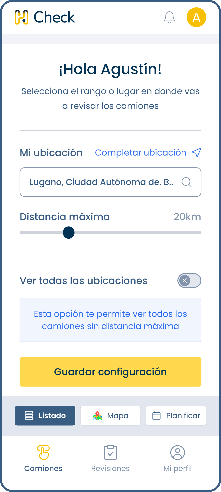
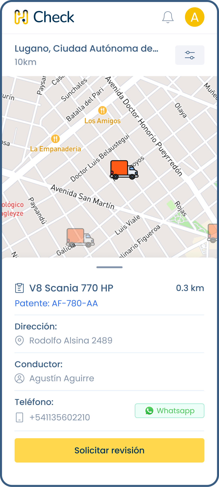
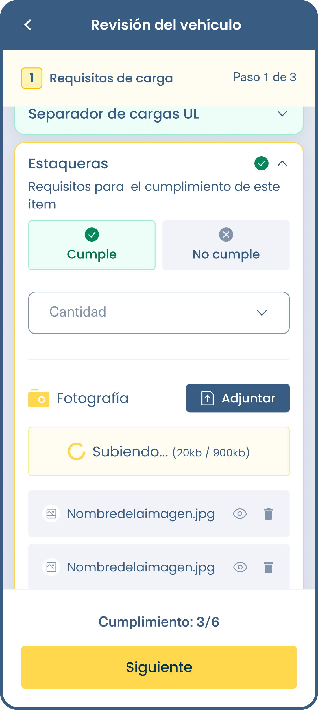
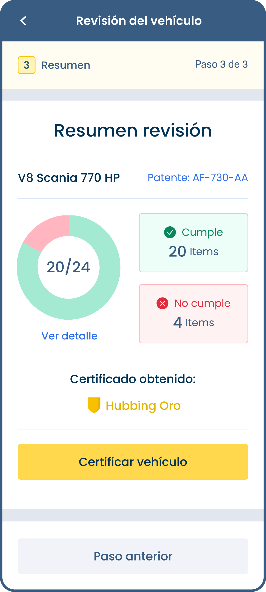

I spearheaded the development of Check, a specialized application designed for truck checkers. Check revolutionizes the inspection process by enabling users to schedule inspections, complete detailed checklists, and seamlessly document inspection results. With features like photo uploads and descriptive entries, Check facilitates regulatory compliance and operational excellence, empowering truck checkers to efficiently manage inspections while ensuring adherence to industry standards.

With a strong emphasis on user-centric design and functionality, Check simplifies complex inspection procedures, streamlining workflows, and enhancing productivity. By harnessing innovative technologies, Check sets a new standard for efficiency and accuracy in the trucking industry, providing users with a powerful tool to optimize their inspection processes.

### Gallery

