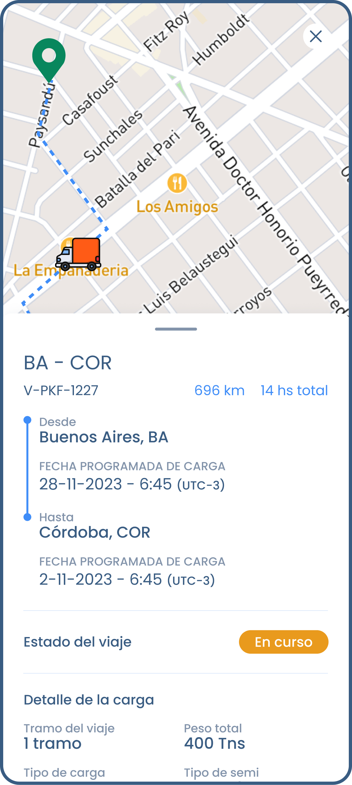

I developed the Driver app, a comprehensive solution tailored specifically for truck drivers. With a focus on safety and efficiency, Driver offers intuitive features including real-time trip visualization, offline support, and emergency SOS alerts. By leveraging these functionalities, Driver ensures that truck drivers can navigate their journeys with confidence, even in remote areas or areas with poor connectivity.

Driver's user-friendly interface and robust features make it an indispensable tool for truck drivers, allowing them to stay informed and empowered throughout their trips. Through the development of Driver, I demonstrated my commitment to delivering practical solutions that prioritize the needs of users in the transportation industry.

### Gallery

