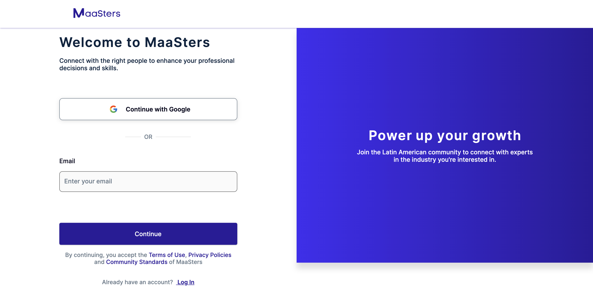
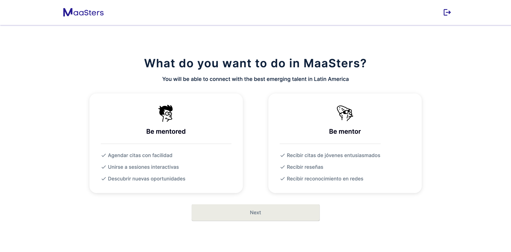
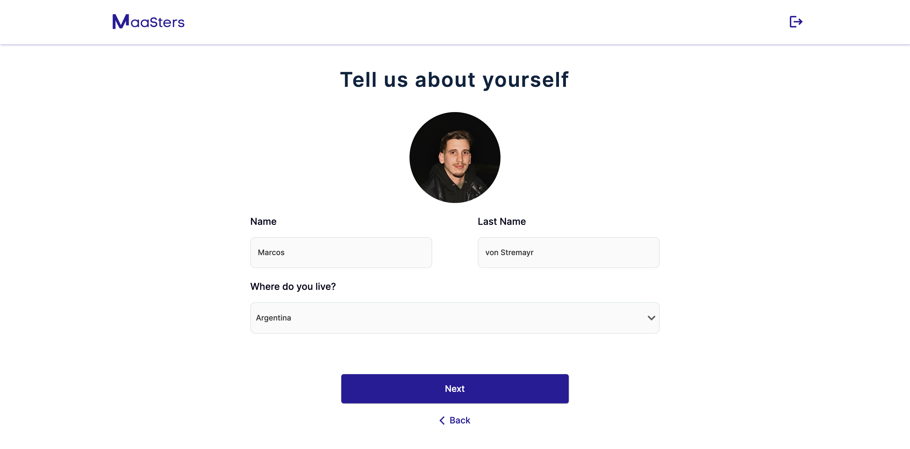
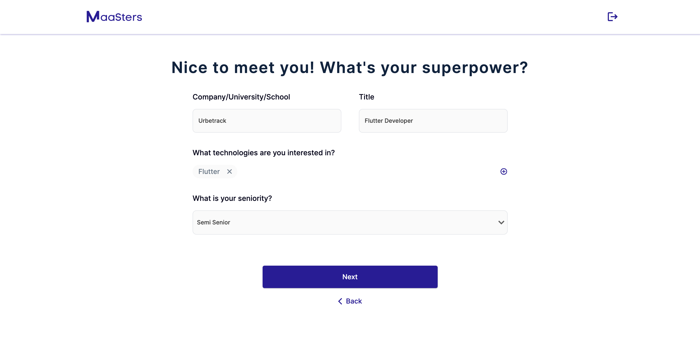
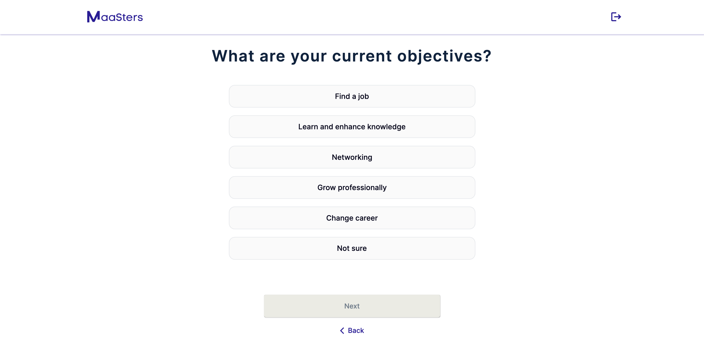
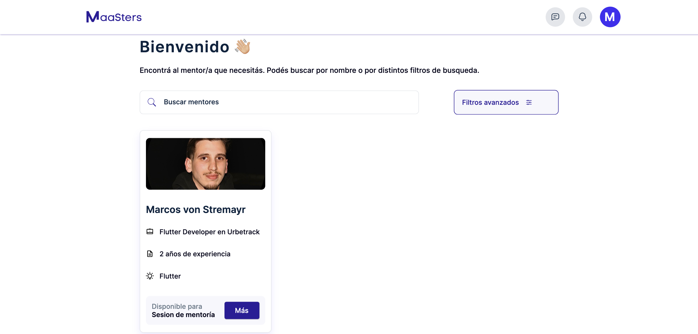

Maasters is a professional Flutter web app designed to revolutionize the learning experience by connecting tech mentors with companies and their employees. Our platform personalizes education based on each mentee's needs, offering a tailored learning path that differs from traditional online courses.

Technologies used in Maasters include Cloud Firestore, Firebase Authentication, Cloud Storage, and Firebase Hosting. For efficient state management, we implemented BLoC with Freezed. The project also integrates essential packages such as rxdart, dartz, formz, flutter_localizations, intl, getIt, hive, and image_picker.

Following the Very Good Architecture recommended by Very Good Ventures (VGV), Maasters boasts a robust and scalable codebase. It sets a new standard in tech mentorship, providing personalized learning and expert guidance to mentees.

### Gallery

