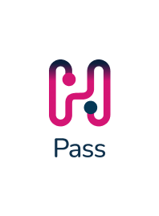
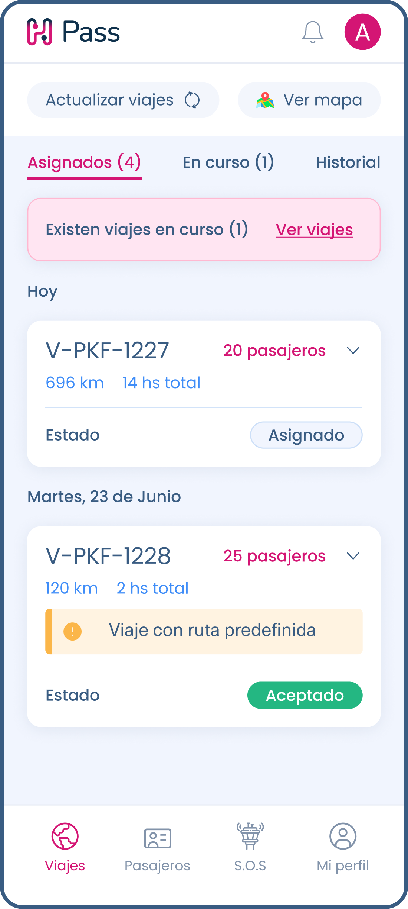
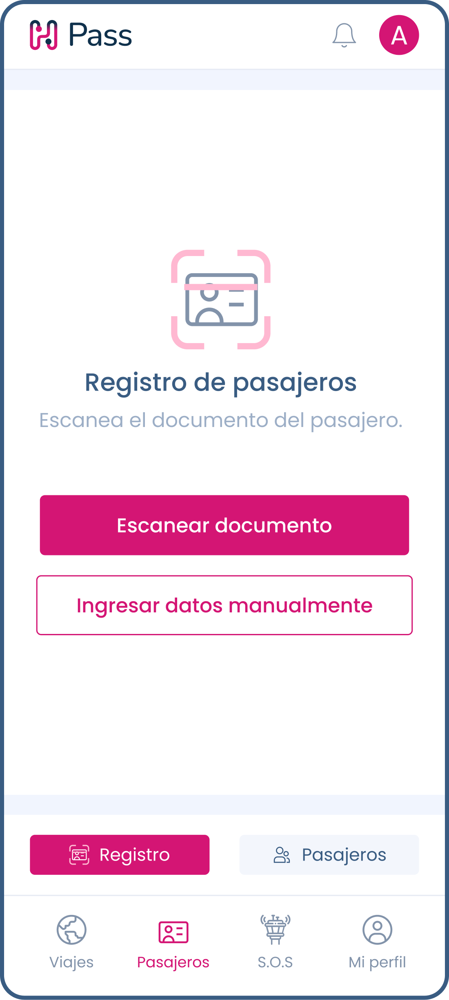
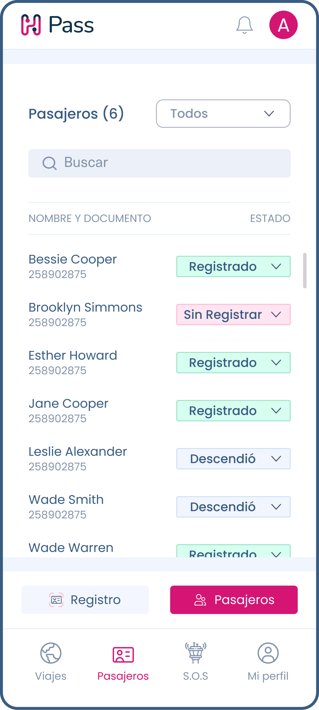
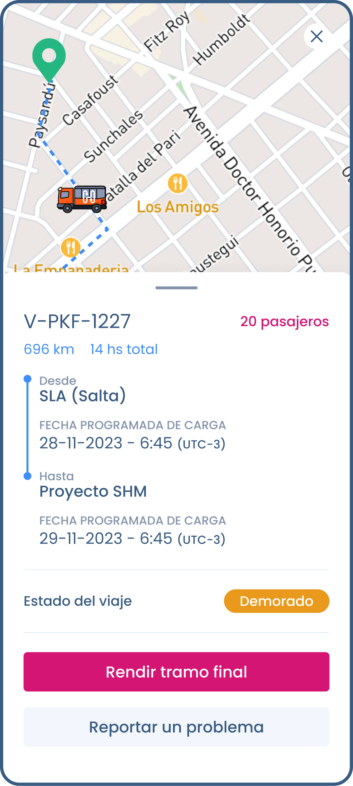
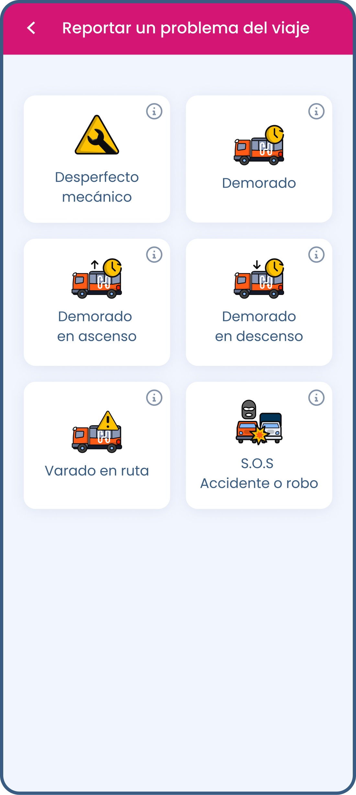

I spearheaded the development of Pass, a tailored application specifically crafted for bus drivers. Pass goes beyond conventional functionalities by seamlessly integrating advanced passenger management tools such as onboard registration scanning and national ID verification. This innovative approach not only streamlines operations but also enhances passenger safety, providing bus drivers with comprehensive tools to ensure a smooth and secure travel experience for all passengers.

In addition to its cutting-edge features, Pass stands out for its seamless integration with the Driver app. Leveraging my expertise in Flutter development, I implemented strategic Flutter packages to consolidate shared functionalities between Pass and Driver. This strategic approach not only optimized code management and maintenance efforts but also ensured a cohesive user experience across both applications, allowing for seamless navigation and familiarity for users.

Through the development of Pass, I showcased my commitment to delivering solutions that prioritize both efficiency and safety in the transportation industry. By staying at the forefront of technology and implementing innovative features, Pass sets a new standard for passenger management in the bus transportation sector.

### Gallery

