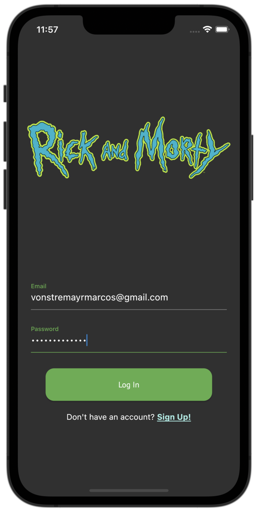
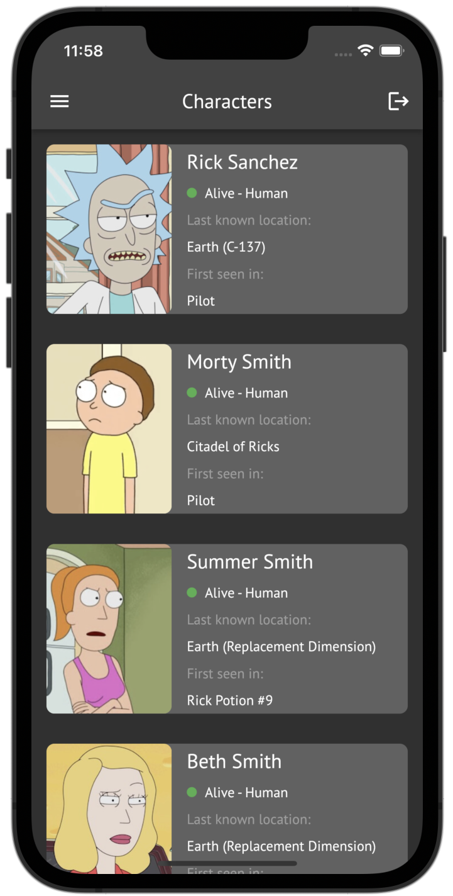
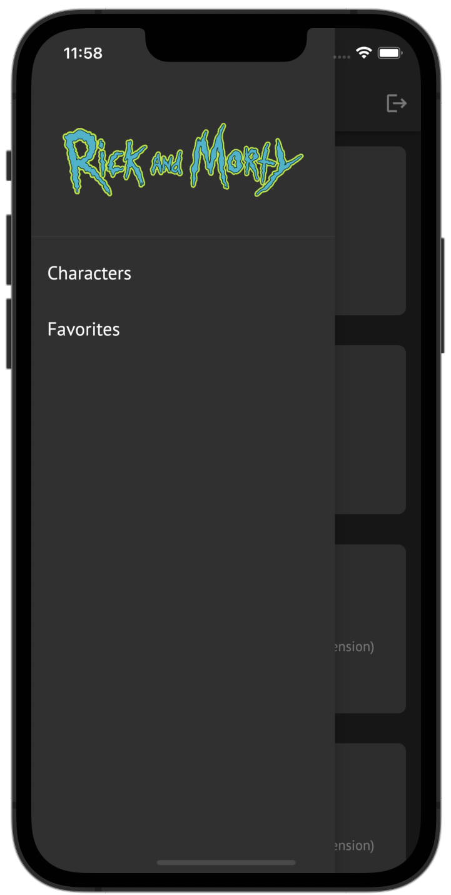
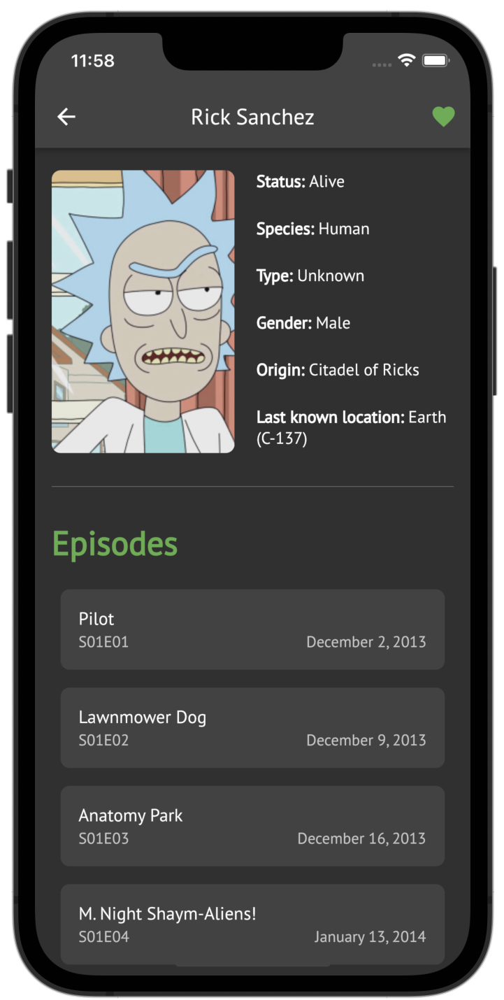
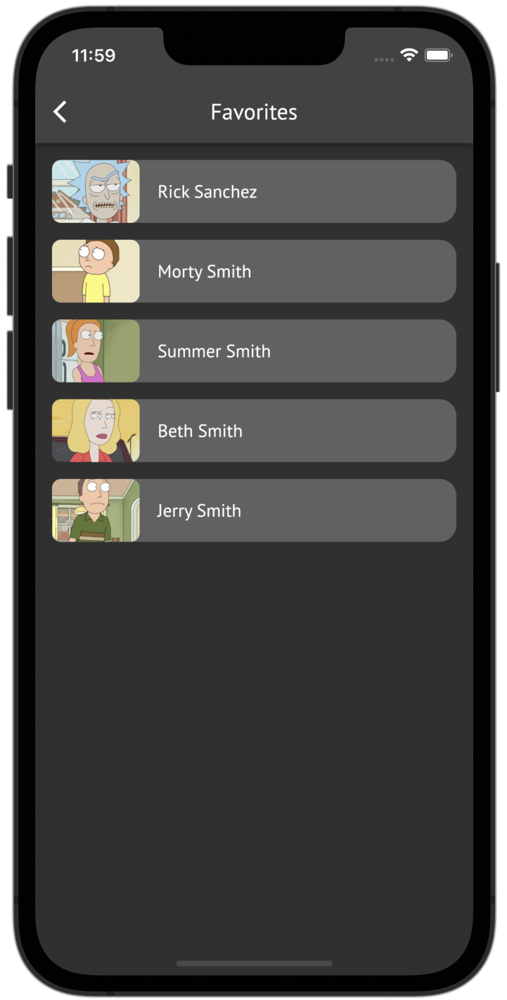

Introducing the Rick And Morty Character Explorer app - a project aimed at exploring the capabilities of Flutter, Firebase Authentication, and Formz. Dive into a vast array of characters from the world of Rick and Morty, access their detailed profiles, and effortlessly manage your favorites.

Powered by the Rick and Morty API (rickandmortyapi.com), this app offers real-time character information, allowing you to explore and learn about various characters from the show.

With the Rick And Morty Character Explorer, you can experiment with features like favoriting characters, demonstrating how Hive and Firebase Authentication work together to create a personalized experience.

This project served as an educational endeavor to implement Firebase Authentication and Formz in Flutter, showcasing how these technologies can be integrated into a mobile app. Efficient state management is achieved through the combination of BLoC and Freezed, providing a solid foundation for future learning and development. Built on the principles of Very Good Architecture by Very Good Ventures, this app ensures a maintainable codebase while offering insights into the process of app development and integration of key features.

