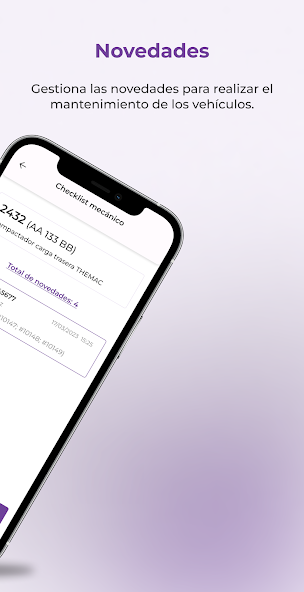

I developed UrbeFleet, a specialized mobile app designed to streamline maintenance tasks for drivers. UrbeFleet simplifies checklists, vehicle services, and document updates, enhancing operational efficiency. By leveraging cutting-edge technologies and industry best practices, I ensured UrbeFleet exceeds driver expectations.

Through iterative development and stakeholder collaboration, UrbeFleet emerged as a robust and intuitive solution. Its user-centric design empowers drivers to manage their daily routines effectively, contributing to the advancement of fleet management practices.

### Gallery

