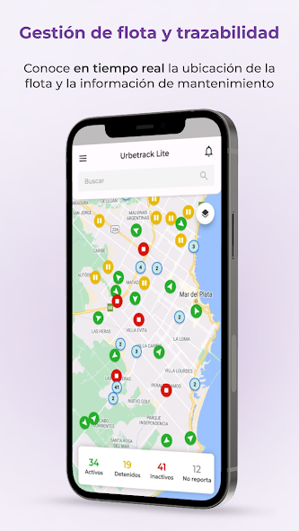
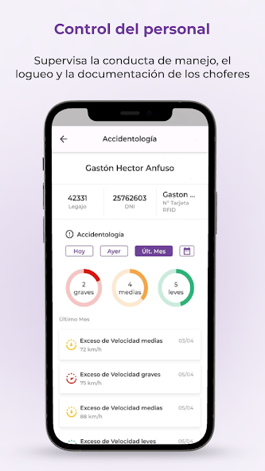
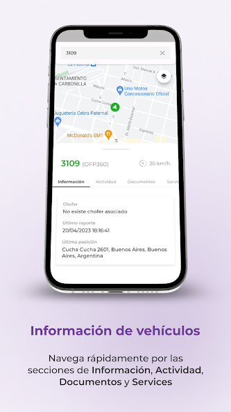
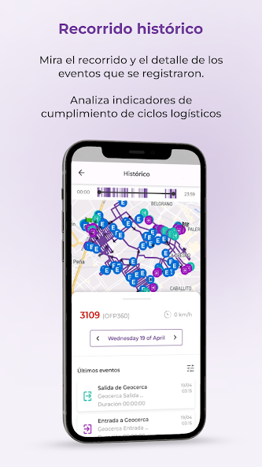
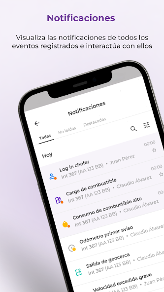

I collaborated on the development of Urbetrack Lite, a cutting-edge mobile application that revolutionized asset management. This robust app delivers a streamlined and efficient approach to tracking fleet locations and maintenance in real-time. Leveraging the latest technology, it empowers users to assess compliance metrics, monitor driving behavior, and maintain comprehensive driver documentation.

Together with a fellow developer, I played a pivotal role in revamping the app’s architecture, aligning it with industry best practices advocated by Very Good Ventures. Notably, we introduced game-changing features like the “Checklist” module, meticulously implementing the BLoC pattern and robust error handling using Either.

Incorporating a strategic blend of popular packages and services, including Google Maps, Permission Handler, Firebase (Analytics, Crashlytics, Messaging), and Hive, we elevated Urbetrack Lite’s functionality and performance to unprecedented levels.

### Gallery

